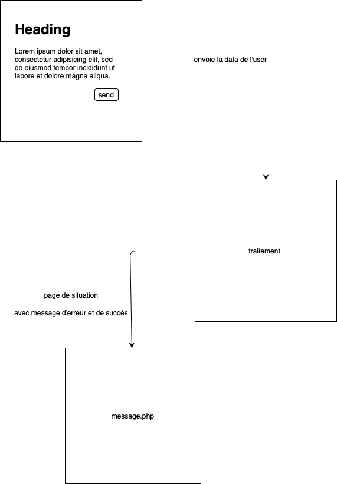

# exercice 3 #
****

commencer a detachée votre code en plusieurs couche d'abstraction 
ici des template de balise html et des traitement detache des fichier de vue.

envoyer et traiter des données depuis un formulaire, dynamiser le site 

****

### LOOKING ###
les superglobales (get, post, sessions, cookie)
l'include, require
header (redirection)

****

  

* include un morceau de template (ici la nav) dans le reste des pages de vue 
* dans le fichier index.php faire un formulaire (libre) 
* creer un page traitement.php qui servira a traiter les informations du formulaire
* liée le formulaire avec sa page de traitement en methode get
* watch and analyse comment est envoyer les datas par la methode get essayer de vardump $_get dans la page traitement
* inspecteur => reseau (ragarder la requete qui vous à était envoyer)
* retourner dans le fichier index.html et changer la methode pour un post  
* watch and analyse comment est envoyer les datas avec la methode post
* dans la page de traitement verifier et traiter l'information qui à etais envoyée (securisée là, assurer vous quel ne soit pas vide et autre check):
  * je recuperer la data
  * je traite la data 
  * j'execute des actions en rapport au traitement 
* je redirige ensuite sur la page message.php accompagner de data permetant d'effectuer des message d'erreur ou un message de succes 

****
objectif savoir envoyer, recuperer, traite, renvoyer data pour l'utiliser 
faire des couches d'abstraction (ici differencier les couches traitement et les vues)
